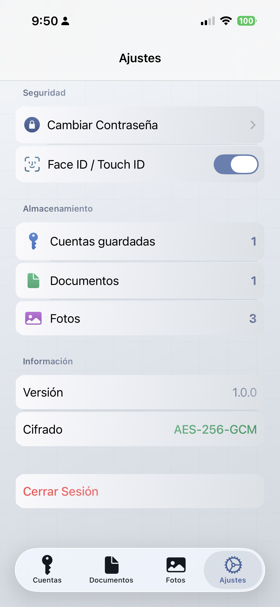
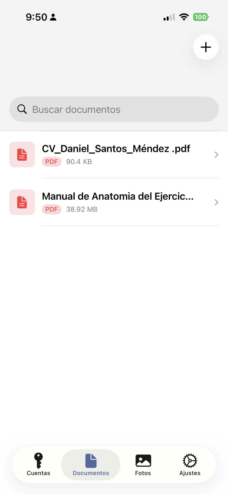
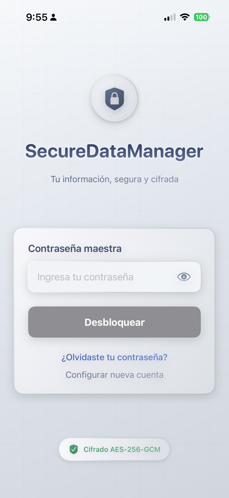

# 🔐 SecureDataManager

Una aplicación iOS de gestión de datos segura con cifrado AES-256-GCM, diseñada para proteger tus contraseñas, documentos y fotos con los más altos estándares de seguridad.


## 📱 Descripción

**SecureDataManager** es una aplicación de seguridad que permite almacenar y gestionar información sensible de manera cifrada. Utiliza criptografía de grado militar para garantizar que tus datos permanezcan privados y seguros, incluso si el dispositivo cae en manos equivocadas.

### Diseño Metálico Premium
La aplicación cuenta con un diseño metálico sofisticado que se adapta al modo claro y oscuro del sistema, proporcionando una experiencia visual moderna y profesional.

---

## 🖼️ Capturas de Pantalla

### 🔐 Pantalla de Login

*Pantalla de autenticación con diseño metálico plateado. Permite ingresar la contraseña maestra y acceder mediante Face ID/Touch ID.*

### 🔑 Gestión de Cuentas

*Lista de cuentas guardadas con cifrado AES-256. Visualización segura de contraseñas y opciones de recuperación.*

### 🔄 Recuperación de Cuenta

*Sistema de recuperación mediante preguntas de seguridad personalizadas y código de recuperación único.*

---

## ✨ Características Principales

### 🔐 Seguridad de Grado Militar
- **Cifrado AES-256-GCM** para todos los datos almacenados
- **Master Key aleatoria** de 256 bits generada criptográficamente
- **PBKDF2** con 600,000 iteraciones para derivación de claves
- **Protección contra fuerza bruta** con bloqueo temporal
- **Autenticación biométrica** (Face ID / Touch ID) + contraseña

### 📂 Almacenamiento Seguro
- **Cuentas**: Guarda contraseñas, nombres de usuario y datos de inicio de sesión
- **Documentos**: Almacena archivos de texto con cifrado completo
- **Fotos**: Protege imágenes privadas con cifrado AES-256

### 🔄 Sistema de Recuperación Híbrido
- **3 Preguntas de seguridad personalizadas** (definidas por el usuario)
- **1 Código de recuperación** único de 32 bytes (Base64)
- Recuperación de cuenta sin comprometer la seguridad
- Las preguntas pueden ser completamente personalizadas

### 🎨 Interfaz de Usuario
- **Diseño metálico adaptativo** con degradados plateados
- **Modo oscuro y claro** automático
- **Animaciones fluidas** y feedback táctil
- **Indicadores de fuerza de contraseña** en tiempo real

---

## 🛡️ Arquitectura de Seguridad

### Flujo de Cifrado

```
┌─────────────────┐     ┌─────────────────┐     ┌─────────────────┐
│   Contraseña    │────▶│   PBKDF2        │────▶│   Clave         │
│   del Usuario   │     │   (600k iter)   │     │   Derivada      │
└─────────────────┘     └─────────────────┘     └─────────────────┘
                                                          │
                                                          ▼
┌─────────────────┐     ┌─────────────────┐     ┌─────────────────┐
│   Datos         │◀────│   AES-256-GCM   │◀────│   Master Key    │
│   Descifrados   │     │   Encriptación  │     │   Aleatoria     │
└─────────────────┘     └─────────────────┘     └─────────────────┘
                                                          │
                              ┌───────────────────────────┘
                              ▼
                    ┌─────────────────┐
                    │   Almacenada    │
                    │   en Keychain   │
                    └─────────────────┘
```

### Sistema de Recuperación

```
┌─────────────────┐     ┌─────────────────┐     ┌─────────────────┐
│   Respuestas    │     │   PBKDF2        │     │   Clave de      │
│   (3) + Código  │────▶│   (600k iter)   │────▶│   Recuperación  │
│   (1)           │     │                 │     │                 │
└─────────────────┘     └─────────────────┘     └─────────────────┘
                                                          │
                                                          ▼
                                              ┌─────────────────┐
                                              │   Desencripta   │
                                              │   Master Key    │
                                              └─────────────────┘
```

### Medidas de Seguridad Implementadas

| Característica | Implementación |
|----------------|----------------|
| Cifrado de Datos | AES-256-GCM (AEAD) |
| Derivación de Claves | PBKDF2-HMAC-SHA256 |
| Iteraciones PBKDF2 | 600,000 |
| Almacenamiento de Claves | iOS Keychain (kSecAttrAccessibleWhenUnlockedThisDeviceOnly) |
| Autenticación | 2FA (Contraseña + Biometría) |
| Protección Fuerza Bruta | 5 intentos + bloqueo temporal progresivo |
| Comparación de Hashes | Tiempo constante (previene timing attacks) |

---

## 📋 Requisitos

- **iOS**: 16.0 o superior
- **Dispositivo**: iPhone o iPad compatible
- **Hardware**: Face ID o Touch ID recomendado para máxima seguridad

---

## 🚀 Instalación

1. Clona el repositorio:
```bash
git clone https://github.com/tuusuario/SecureDataManager.git
```

2. Abre el proyecto en Xcode:
```bash
cd SecureDataManager
open SecureDataManager.xcodeproj
```

3. Compila y ejecuta en tu dispositivo iOS o simulador.

---

## 📖 Uso

### Primer Inicio

1. **Crea tu contraseña maestra** (mínimo 12 caracteres, mayúsculas, minúsculas, números y símbolos)
2. **Configura 3 preguntas de seguridad personalizadas**
   - Puedes escribir tus propias preguntas o usar las sugeridas
   - Las preguntas personalizadas ofrecen mayor seguridad
3. **Guarda tu código de recuperación** en un lugar seguro fuera del dispositivo
4. **Habilita Face ID / Touch ID** para acceso rápido y seguro

### Acceso Diario

1. Abre la aplicación
2. Ingresa tu contraseña maestra
3. Autentícate con Face ID / Touch ID
4. Accede a tus cuentas, documentos y fotos de forma segura

### Recuperación de Cuenta

Si olvidas tu contraseña:

1. Toca "¿Olvidaste tu contraseña?"
2. Responde tus 3 preguntas de seguridad
3. Ingresa tu código de recuperación
4. Establece una nueva contraseña
5. ¡Tus datos siguen seguros y accesibles!

---

## 🏗️ Estructura del Proyecto

```
SecureDataManager/
├── Crypto/
│   ├── CryptoService.swift         # Servicio de cifrado AES-256-GCM
│   └── RecoveryManager.swift       # Gestión de recuperación de cuenta
├── Models/
│   ├── EncryptedAccount.swift      # Modelo de cuenta cifrada
│   ├── EncryptedDocument.swift     # Modelo de documento cifrado
│   ├── EncryptedPhoto.swift        # Modelo de foto cifrada
│   └── RecoveryData.swift          # Datos de recuperación
├── Security/
│   ├── KeychainManager.swift       # Gestión de Keychain
│   ├── DataStore.swift             # Almacenamiento local cifrado
│   └── BruteForceProtection.swift  # Protección contra ataques
├── ViewModels/
│   ├── AuthViewModel.swift         # Lógica de autenticación
│   ├── SetupViewModel.swift        # Lógica de configuración
│   └── [Otros ViewModels]
├── Views/
│   ├── Auth/
│   │   └── LoginView.swift         # Pantalla de login
│   ├── Setup/
│   │   ├── SetupPasswordView.swift
│   │   └── SecurityQuestionsSetupView.swift
│   ├── Recovery/
│   │   └── RecoveryView.swift      # Recuperación de cuenta
│   ├── Theme/
│   │   └── MetallicTheme.swift     # Sistema de tema metálico
│   └── [Otras vistas]
└── Utils/
    └── Extensions/                 # Extensiones útiles
```

---

## 🔬 Detalles Técnicos

### Cifrado AES-256-GCM

El modo GCM (Galois/Counter Mode) proporciona:
- **Confidencialidad**: Los datos están completamente cifrados
- **Autenticidad**: Tags de autenticación de 128 bits
- **Integridad**: Detección de cualquier modificación de datos

### Almacenamiento Seguro

- **Keychain**: Almacena la Master Key encriptada y datos de autenticación
- **Archivos JSON cifrados**: Datos de cuentas, documentos y fotos
- **Directorio protegido**: Document directory de la app (sandbox)

### Protección contra Fuerza Bruta

```swift
Intento 1-3:  Sin espera
Intento 4:    1 minuto de bloqueo
Intento 5:    5 minutos de bloqueo
Intento 6+:   15 minutos de bloqueo
```

---

## 🤝 Contribución

Las contribuciones son bienvenidas. Por favor, sigue estos pasos:

1. Fork el repositorio
2. Crea una rama para tu feature (`git checkout -b feature/nueva-caracteristica`)
3. Commit tus cambios (`git commit -am 'Agrega nueva característica'`)
4. Push a la rama (`git push origin feature/nueva-caracteristica`)
5. Abre un Pull Request

---

## 📝 Licencia

Este proyecto está licenciado bajo la Licencia MIT - ver el archivo [LICENSE](LICENSE) para más detalles.

---

## ⚠️ Descargo de Responsabilidad

**SecureDataManager** es una aplicación de seguridad diseñada para proteger tu información personal. Sin embargo:

- **La seguridad absoluta no existe**
- Mantén tu contraseña maestra y código de recuperación en lugares seguros
- No nos hacemos responsables por la pérdida de datos debido al olvido de credenciales
- Se recomienda hacer respaldos periódicos de información crítica

---

## Frameworks

- [Apple CryptoKit](https://developer.apple.com/documentation/cryptokit) - Framework de criptografía
- [SwiftUI](https://developer.apple.com/documentation/swiftui) - Framework de UI moderno
- [LocalAuthentication](https://developer.apple.com/documentation/localauthentication) - Framework de autenticación biométrica
---
